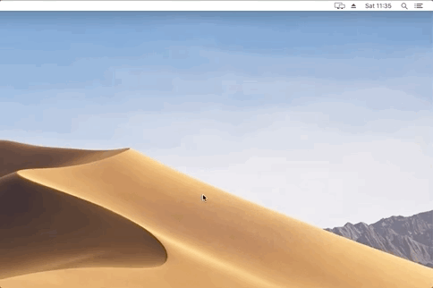

#  Lock.app [](https://travis-ci.org/duksis/Lock)

Locks your Mac


## Intro

A simple Mac application that does only one thing
----> It locks your Mac!




## Installation

1. Download [the image](https://github.com/duksis/Lock/releases/download/v1.0.2/lock.dmg)
2. Open it
3. Move `Lock` app to your `Applications` folder


## Background

Was using [Alftred app](https://www.alfredapp.com) for multiple years and recently realised that
from all of it's features and fancy configuration I have set up long time ago I was using exactly
nothing. I was still using it every day, but just for two things:
1. opening a application (mainly iTerm and Chrome)
2. Locking my machine whenever I was leaving

So the first thing regular Spotlight can do as well, for my new setup I decided on the minimalist
approach. After a week or so I realised that I can't get used to locking with `⌘⌃Q` and hot corners
are not a solution, but a problem by themselves.

Instead of switching back to Alfread I decided to create a simple application that is just locking
the machine when it is triggered and name it `Lock` this way Spotlight should be able to find
it and suggest you it whenever you are typing `Lock` hopefully already on the first letters.


## Default ways

The default way to lock your macOS Mojave machine is **Command+Control+Q**

for more options there is a detailed list on [macpaw](https://macpaw.com/how-to/lock-mac-screen)


## Locking from Command-line

The [core](./Lock.app/Contents/MacOS/main.command) of this app is a simple one line call to one of MacOS core services
and if you spend most of your time in the command-line you can just create a alias for it
within your shell configuration (~/.bashrc, ~/zshrc ...)

```sh
alias lock='/System/Library/CoreServices/"Menu Extras"/User.menu/Contents/Resources/CGSession -suspend'
```


## Known issues

Spotlight does not learn from your actions like Alfred does - if you have multiple applications
with `lock` in their name or description the lock app might not come up in the first place.


## Development

Clone the repo:
```
git clone git@github.com:duksis/Lock
```

After making changes install the development version locally:
```
cp -Rv Lock/Lock.app /Applications/
```


## Releasing

1. run `scripts/bump_version NEW.VERSION.NUMBER`
2. push your changes
3. create a [new release](https://github.com/duksis/Lock/releases/new)


## License
Lock.app is released under the [MIT License](./LICENSE).
